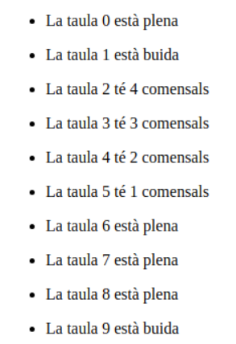
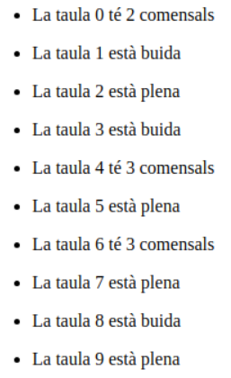
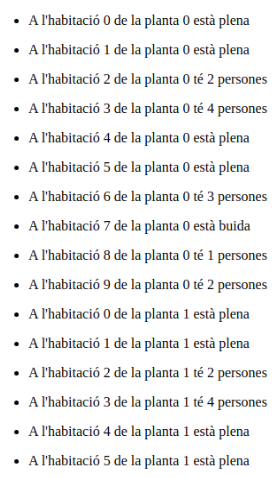

# GESTIÓ HOTEL en PHP
**Nom: Oscar Pérez**

## Feina Individual

Volem gestionar un hotel, en concret, les taules del restaurant i les habitacions de l’hotel.  
S’ha de realitzar cada exercici en php amb HTML

<ol> 
    <li>
    El restaurant estarà format per 10 taules, on cada taula hi caben fins a 5 comensals. 
    Volem una sortida a la terminal tal que: 

   
    Recomanació: Feu, individualment o per parelles, el plantejament, sense codi, de la possible solució de l’exercici. Afegir una foto a captures de pantalla d’aquesta solució plantejada. (10 minuts)  
    Observacions:
    <ul>
        <li>Quan indica “**la taula està plena**” vol dir que té 5 comensals.
        <li>Quan indica “**la taula està buida**” vol dir que té 0 comensals.
        <li>S’ha d’utilitzar una **array** per les taules i els comensals.
        <li>S’ha d’utilitzar un **for** per introduir dades a l’array.
        <li>S’ha d’utilitzar un **for** amb condicionals per recórrer l’array i mostrar les dades.
        <li>Mirar la funció **[rand](https://www.php.net/manual/es/function.rand.php)**.
    </ul>
</ol>

## Feina Grupal

Es tracta de programar la gestió d’habitacions d’un hotel. 
<ol>
    <li>Imagineu un hotel amb 5 plantes i 10 habitacions en cadascuna de les plantes. Es v guardar el nombre de clients que hi ha en cada habitació. Com a màxim hi pot haver 4 clients per habitació.

  
    Cal que per parelles feu el plantejament, sense codi, de la possible solució de l’exercici. Afegir una foto a captures de pantalla d’aquesta solució plantejada (10 minuts).  
    Observacions:
    <ul>
        <li>Necessitarem utilitzar una **array de dues dimensions** (una array d’arrays).
    </ul>
</ol>
